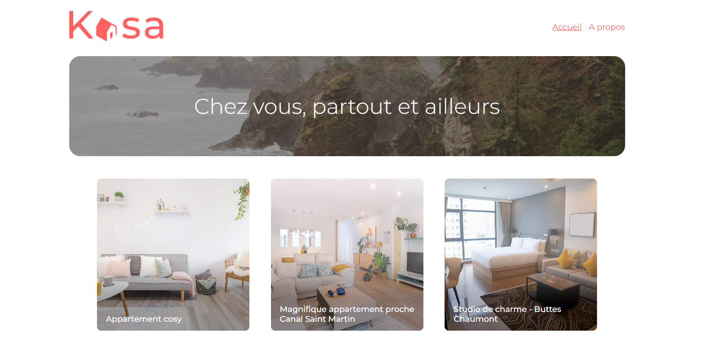

# KASA (with Create React App)

This project was bootstrapped with [Create React App](https://github.com/facebook/create-react-app).

![html][html5-badge]
![css][css3-badge]
![javascript][javascript-badge]
![react][react-badge]

### Description:

Kasa est dans le métier de la location d’appartements entre particuliers depuis près de 10 ans maintenant. Avec plus de 500 annonces postées chaque jour Kasa fait partie des leaders de la location d’appartements entre particuliers en France.
Le site de Kasa a été codé il y a maintenant plus de 10 ans en ASP.NET avec un code legacy important. Laura, la CTO, a donc lancé une refonte totale pour passer à une stack complète en JavaScript avec NodeJS côté Back-end, et React côté Front-end. Kasa en a également profité pour commander de nouvelles maquettes auprès de son designer habituel, qui est en freelance. Un gros chantier pour cette année !

### Objectif

Démarrer le projet React et développer l’ensemble de l’application, les composants React, les routes React Router, en suivant les maquettes [Figma](https://www.figma.com/file/2BZEoBhyxt5IwZgRn0wGsL/Kasa_FR?type=design&node-id=0-1&mode=design) (responsives !)

### Prérequis

- [Node.js](https://nodejs.org/en/)

## Installation

- Forker puis cloner le repository à l'adresse suivante :
  `git clone https://github.com/afarkhsi/KASA.git`
- La commande `npm install` vous permettra d'installer les dépendances liée à ce repository
- La commande `npm start` vous permettra par la suite de lancer l'application.
- HR-Net est lancée sur `http://localhost:3000`

<!-- BADGE LINKS -->

[html5-badge]: https://img.shields.io/badge/HTML5-E34F26?style=for-the-badge&logo=html5&logoColor=white
[css3-badge]: https://img.shields.io/badge/CSS3-1572B6?style=for-the-badge&logo=css3&logoColor=white
[javascript-badge]: https://img.shields.io/badge/JavaScript-F7DF1E?style=for-the-badge&logo=javascript&logoColor=black
[typescript-badge]: https://img.shields.io/badge/TypeScript-007ACC?style=for-the-badge&logo=typescript&logoColor=white
[react-badge]: https://img.shields.io/badge/React-20232A?style=for-the-badge&logo=react&logoColor=61DAFB
